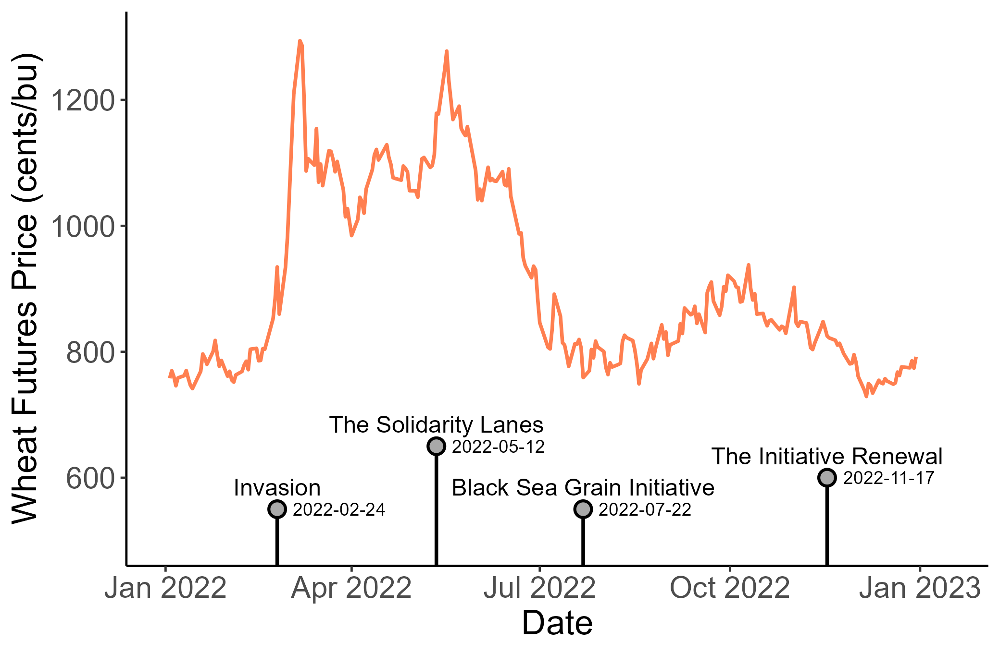
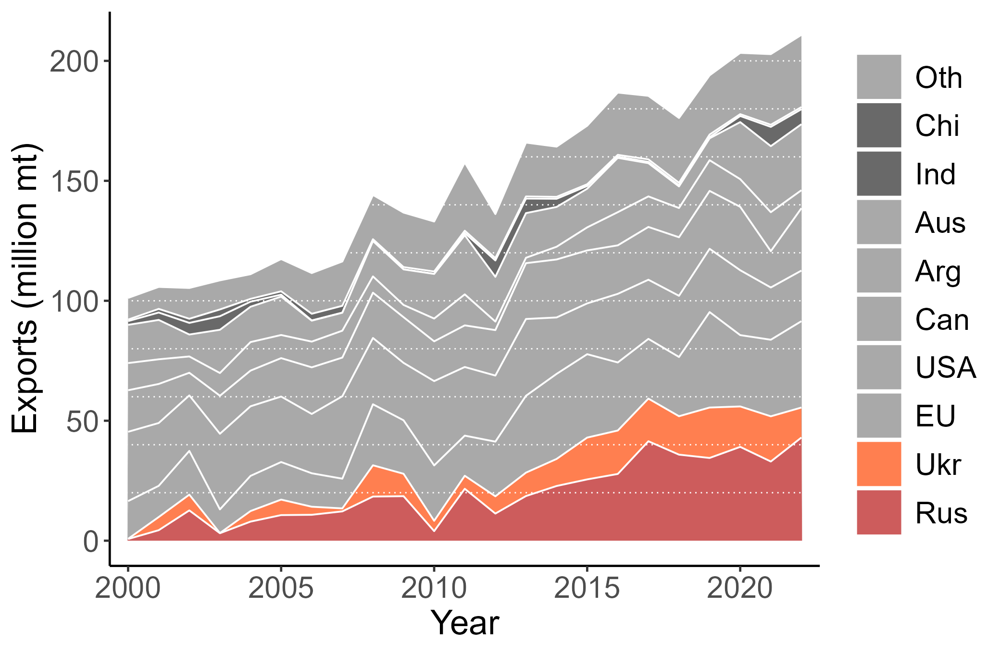
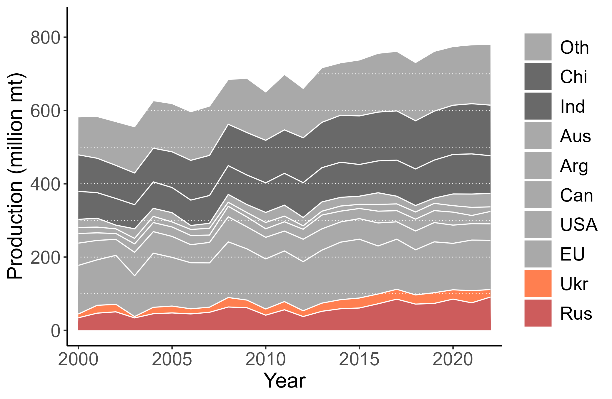

```{r setup, include=FALSE}
knitr::opts_chunk$set(echo = FALSE)
```


# Turbulence in agricultural markets

.right-column[
Much has been said and written about soaring prices of wheat (and other key cereals) and the repercussions of this price surge from March 2022 onward. 

The initial price increase was of historical proportions. The wheat price movement closely tracked the timeline of key relevant events.
]

---

# Wheat futures during the war and agreements

.pull-left[
- Wheat prices surged at the onset of the war.
- War-induced market disruption and the sanctions that followed were both at play.
- The agreement on "grain corridor" reverted prices to the pre-war levels.
]

.pull-right[

]

---

# Trends in wheat exports  

.pull-left[
- Russia and Ukraine account for more than a quarter of world wheat exports. 
- These exports are at par with combined exports from EU and the USA -- the two major wheat-exporting regions.
]

.pull-right[

]

---


# Trends in wheat production  

.pull-left[
- Russia and Ukraine account for more than a quarter of world wheat exports. 
- These exports are at par with combined exports from EU and the USA -- the two major wheat-exporting regions.
]

.pull-right[

]

---


# Cereal price spikes in recent history

.pull-left[
- In this century only, the markets have witnessed dramatic increase in prices in 2007-2008, and then in 2010-2011. 
- Most recently, prices of wheat and maize, have been on the rise since the beginning of the Covid-19 pandemic.
]

.pull-right[

]

---

# Russian wheat export bans

.right-column[
Focusing on wheat, this is not the first time a large exporting country such as Russia has restricted its exports. 

- In 2010, in the wake of the drought-induced poor harvest, Russia banned wheat exports for the reminder of the year, and then extended this ban for the first half of 2011.
- During the 2007-2008 commodity price boom, Russia imposed an export tax of up to 40 percent, while in 2015, Russia imposed an export tax of 15 percent with an additional payment of 7.5 euros per ton.
]

---

# Reactive policies amplify shocks

.right-column[
The foregoing anecdotal evidence underscores the complexity of factors contributing to short term trends in global commodity markets. 

Usually multiple factors are at play, which often exacerbate the issue.

- The 2010 export ban by Russia was triggered by a climate shock and the related poor harvest of wheat in the country.
- The 2022 export ban by India was triggered by a political shock and the related disruptions in the global wheat trade. 
]

---


# Causes of the market disruption

.right-column[
## Climate shocks

Climate shocks and commodity prices are linked through the well established weather - production - prices channel.

Two aspects of this relationship are of relevance. First, because cereal grains are grown and harvested annually, the effect of the weather shocks on production also is manifested at annual frequency. 

However, the expectations about the yields are formed at higher frequency, and updated regularly though various information shocks.
]

---


# Causes of the market disruption

.right-column[
## Climate shocks

Second, on a global scale, the weather shocks and harvest seasons are not synchronized due to geographical disparities in these shocks as well as seasonal differences between northern and southern hemispheres. 

Thus, two similar weather shocks in a major crop-producing region can have very different price effects depending on what has happened in other regions (concurrently or in the recent past). 
]

---


# Causes of the market disruption

.right-column[
## Energy shocks

Energy and food markets are linked. Higher energy prices impact agricultural markets through input and transportation costs.

- Increase in international freight prices, for example, were a notable factor that led to growing food prices from 2021 onward.
]


---


# Causes of the market disruption

.right-column[
## Energy shocks

In the past two decades, biofuel production and the associated mandates have become key contributing factors in this relationship.

- Increased demand for maize due to U.S. biofuel mandates, was one of the main reasons of the 2007-2008 price spike, for example. 
]


---


# Causes of the market disruption

.right-column[
## Information shocks

Weather or geopolitical events affect prices when information becomes available to the markets. A lack of complete information followed by a sudden update can bring about a price shock.

A classic example is the "great grain robbery" of 1972, when the Soviet Union purchased over one billion bushels of wheat from the United States. The U.S. at the time was not aware that the USSR had a crop failure in that year. When this information revealed - world grain prices soared.
]

---


# Causes of the market disruption

.right-column[
## Policy shocks

Government interventions tend to be featured prominently during food price spikes. Net food-importing countries typically intervene by lowering import tariffs and taxes, while net food-exporting countries often impose export restrictions.

Such interventions amplify price spikes. For example, changes in trade restrictions by several major rice producing countries have largely led to the 2008 global rice crisis.
]

---


# Causes of the market disruption

.right-column[
## Policy shocks

The retaliatory changes in border protection rates manifest into the so-called "trade wars," which can significantly impact commodity prices. 

The trade war between the U.S. and China beginning in 2018 led to China levying a 25 percent retaliatory import tariff on U.S. soybean exports. The tariff severely disrupted U.S. soybean exports to China, resulting in a sudden drop in soybean prices in the U.S. and an increase in soybean prices in the rest of the world. 
]

---


# Causes of the market disruption

.right-column[
## Other shocks

The invasion of Ukraine is a case of a geopolitical event that triggered a significant spike in commodity prices - primarily of cereal grains and to some extent of vegetable oils as well.

The Covid-19 pandemic had a very limited *initial* impact on world food commodity prices, partly due to surprisingly resilient global food supply chains. Over time, constant disruptions and increased uncertainty contributed to the 2022 food crisis.
]

---


# Consequences of the market disruption

.right-column[
The global commodity price shocks matter because they drive food prices in many countries. 

Not all countries are affected the same way, however. The transmission of price shocks from global to local markets is not perfect, nor homogeneous across countries or markets within the countries.
]

---


# Consequences of the market disruption

.right-column[
Two dimensions of the price transmission from global commodity markets to local food markets are of importance. 

- Horizontal price transmission - the transmission of the price of a commodity from global to local markets. 
- Vertical price transmission -  locally, the transmission of the price of a commodity to the price of food items produced from that commodity. 
]

---


# Consequences of the market disruption

.right-column[
## Poverty and undernutrition

Soaring food prices first and foremost affect the vulnerable households of low and middle income countries. The 2010-2011 price spike, for example, is estimated to have accounted for 44 million people to fall into poverty.

Global commodity crises impact disproportionately low and middle income countries. In these countries, repercussions are more dire for urban population compared to rural population who may even benefit from increase in commodity prices if they produce these commodities.
]

---


# Consequences of the market disruption

.right-column[
## Poverty and undernutrition

Higher food prices pose risk on the food security, which is realized as a considerable reduction of caloric intake as well as the dietary diversity.

As alluded before, changes on world markets particularly impact people of low and middle income countries that rely on imports. Among these countries, less affected are land-locked countries, or places located inland, where the global-to-local price transmission is somewhat muted.
]

---


# Consequences of the market disruption

.right-column[
## Conflict and violence

One of the effects of increasing food prices is the elevated risk of social unrest and civil conflict. For example, soaring wheat prices in the second half of 2010 partly contributed to the 2011 Arab Spring - the political turmoil that spanned nearly all wheat-importing countries of the Middle East and North Africa (MENA) region, ousting governments and leading to several civil wars in years to follow.
]

---


# Consequences of the market disruption

.right-column[
## Conflict and violence

Food price shocks affect conflict in urban and rural areas differently due to the potentially diverging income effects.

For urban consumers, who are not involved in agricultural production, an increase in the price of a food item will reduce real income. In such instances, social unrest of some form (e.g., protests, riots), fueled by people's inability to satisfy their basic needs, is expected. 
]

---


# Consequences of the market disruption

.right-column[
## Conflict and violence

For rural consumers, and specifically those engaged in agricultural activities, an increase in the price of a commodity can have a positive or negative income effect, depending on whether they also produce or merely consume the commodity. 
]

---

# Consequences of the market disruption

.right-column[
## Conflict and violence

When an increase in commodity prices is income-enhancing, two effects of opposite sign are possible. 
- One the one hand, higher farm income increases the opportunity cost of fighting, thus reducing conflict. 
- On the other hand, higher farm income increases opportunities for appropriation of the agricultural surplus, thus facilitating conflict.
]

